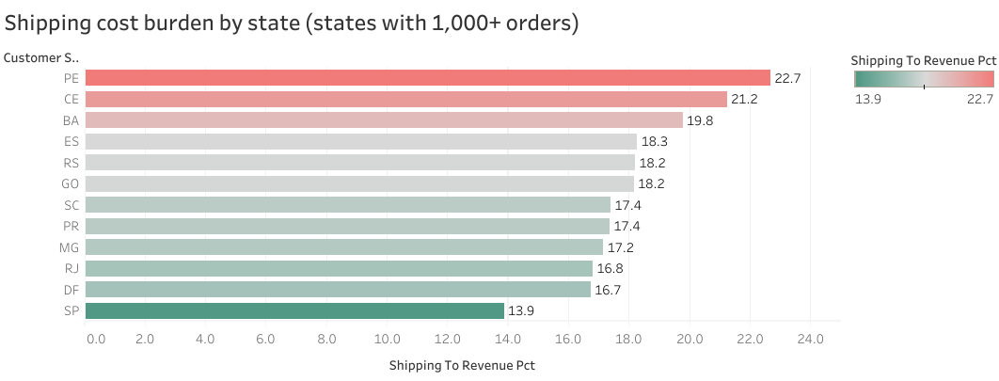
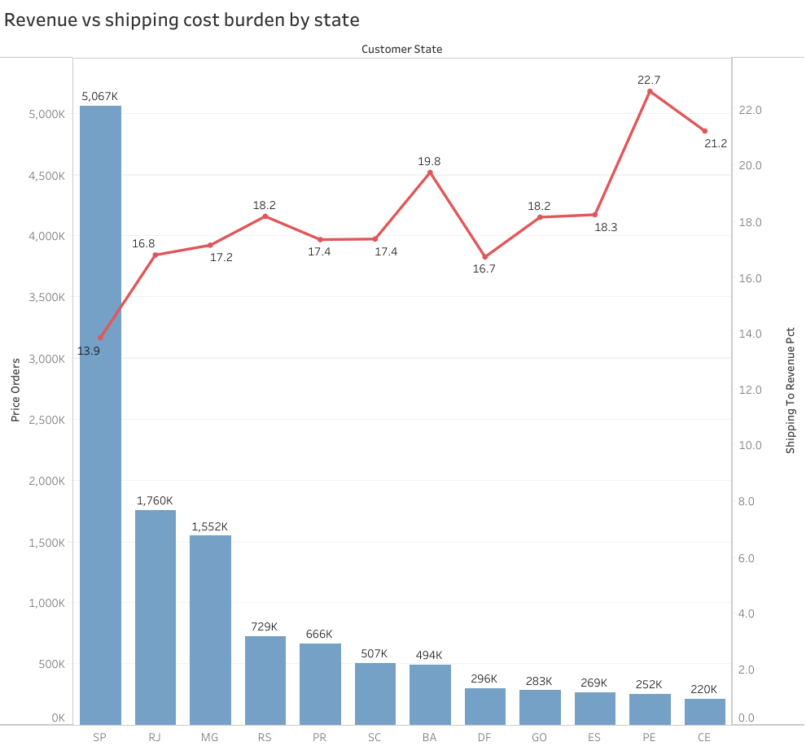
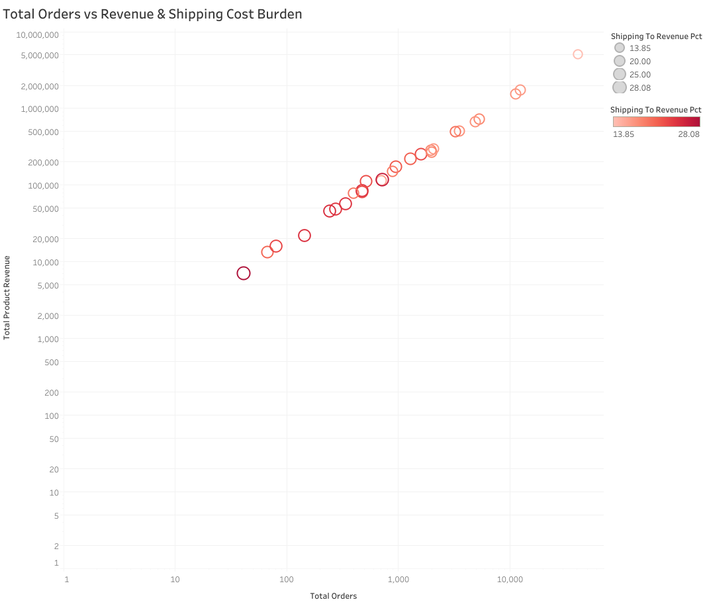

# Olist E-Commerce Insights

Digging into Olist's Brazilian e-commerce data to find where marketing spend is safest, how customers pay for expensive items, and what that means for the business.

**Tools:** Python (loading the data), PostgreSQL (all the analysis), Tableau (charts). Python is only used once, at the very start, to move the raw CSV files into the database — every insight after that comes from SQL queries.

## Step 1: Getting the Data In

Before any analysis can happen, the raw CSV files need to live in a proper database instead of eight separate spreadsheets. This step handles that using a Python script.

Script: [`data_ingestion.py`](./data_ingestion.py)

What it does:
* Reads all 8 CSV files and loads each one into its own PostgreSQL table.
* Uses `encoding='latin1'` — without this, the script crashes on the Portuguese accented characters in the product category names.
* Loads data in batches of 10,000 rows instead of all at once, so it doesn't eat up all the RAM on a normal laptop.
* If one file fails to load, the script skips it and keeps going instead of stopping the whole process.

Once this runs, the database is ready and everything else is done in SQL.

## Q2: Where does shipping cost hurt margins the most?

**SQL:** [Q2.sql](./Q2.sql)

### Cleaning the data (Step 1–2 in Q2.sql)

Before writing the real query, checked how trustworthy the data actually was. Found three things worth flagging:

- **2,965 orders have no delivery date at all** — excluded from the analysis, since there's no way to know yet if they'll go through.
- **Only 96,478 of 99,441 orders are actually marked "delivered."** The rest sit in other statuses like canceled or still shipping.
- **8 orders contradict themselves** — status says delivered, but there's no delivery date attached.

Prices, shipping fees, and duplicate order IDs all came back clean, no issues there.

Based on this, the view (Step 3) filters on two conditions together: status must be `delivered`, and the delivery date can't be missing.

### Picking which states to trust (Step 4–5 in Q2.sql)

Looking at all 27 states unfiltered, a problem showed up fast: **states with very few orders had wildly swinging percentages.** RR had only 41 orders but a shipping cost of 28% of revenue, while SP had 40,494 orders and sat at a steady 13.85%.

Worked through the right cutoff in a few steps:

- Tried the common rule of n ≥ 30 first — but it didn't cut anything out. Even RR, the smallest state, had 41 orders.
- Grouped states by order count and checked how wide the percentages swung within each group. Things settle down once a state passes roughly 1,000–2,000 orders.
- Checked how much of the business gets lost at each cutoff: 1,000 orders drops 6.53% of orders and 8.52% of revenue — a reasonable trade. 2,000 orders (more statistically solid) would drop nearly 16% of revenue — too much just for cleaner numbers.

Landed on **1,000 orders** as the threshold, balancing trust in the statistics against not throwing away too much of the overall picture. The final query (Step 6) uses this cutoff and leaves 12 of the 27 states.

### Chart: Shipping cost burden by state

Among the 12 states with 1,000+ orders, shipping eats between 13.9% (SP) and 22.7% (PE) of revenue — almost a 9-point gap. PE and CE, both in Brazil's northeast, likely sit farther from the main distribution hub, which drives up their shipping costs. SP, probably home to the main warehouse, carries the lowest shipping burden of the group.

Marketing should lean into SP, DF, and RJ first, since they keep more margin per order. Operations should look at a secondary warehouse near Brazil's northeast to shorten the delivery distance to PE and CE.

**What ruled out the other explanations** (full queries in Step 7 of Q2.sql):
- Average product weight is nearly identical across PE, CE, and SP — heavier packages aren't the cause.
- Average product price in PE and CE is actually higher than SP's, not lower — cheap products aren't skewing the ratio either.
- All three states buy from SP-based sellers at a similar rate (71–78% of orders) — it's not about relying on out-of-state sellers more.
- What's left is plain distance: PE and CE sit roughly 2,000+ km from SP, where most sellers are based.

*Shows only states with 1,000+ orders. The rest were excluded — too few orders to draw a reliable pattern from.*

### Chart 2: Revenue vs shipping cost burden by state

Revenue bars drop off fast, from SP (~5M) down to CE (under 250K), while 
the shipping percentage line runs roughly the opposite direction, climbing 
from 13.85% at SP up to a peak of 22.66% at PE. Checked whether order 
count and revenue actually track each other — they do, ranking identically 
across all 12 states. The one clear break in the pattern is DF, whose 
shipping percentage sits lower than states with similar revenue 
(16.74% vs BA's 19.76%).

Likely because DF, Brazil's capital, has unusually good transport 
infrastructure even though it isn't an economic hub like SP. This backs 
up prioritizing ad spend on SP, RJ, and MG, and suggests DF's setup is 
worth digging into further — there may be something to apply to the 
mid-table states (GO, ES, BA).

**Supporting evidence** (full queries in Step 8 of Q2.sql):
- DF's average freight per item (21.07) is genuinely lower than GO 
  (22.56), ES (22.03), and BA (26.49) — not a rounding coincidence.
- Order count and revenue rank identically across all 12 states — this 
  chart reflects both at once, not two separate stories.
- Side note: CE's average revenue per order (~172) runs almost 40% 
  higher than SP's (~125), despite far fewer orders — possibly because 
  distant-state customers bundle more into each order to offset 
  shipping cost.

### Chart 3: More orders means more revenue and lower shipping cost — the pattern holds across all 12 states

Every point lines up along a clear diagonal on the log-log scale, 
confirming that order count and revenue move together almost 1:1 
(matches what Chart 2 showed). SP sits at the top right, the darkest 
green point — highest orders, highest revenue, lowest shipping cost. 
CE sits at the bottom left, colored red — lowest on every count.

The color gradient running from top-right to bottom-left lines up with 
the cause already confirmed in Step 7: distance from the distribution 
hub. This backs up giving SP top priority, since it wins on all three 
fronts at once. States like CE and BA should be operations' first 
focus, since they carry both a small customer base and high shipping 
cost at the same time.

*No outliers here, so there's nothing extra to dig into like there was 
for Charts 1 and 2.*
