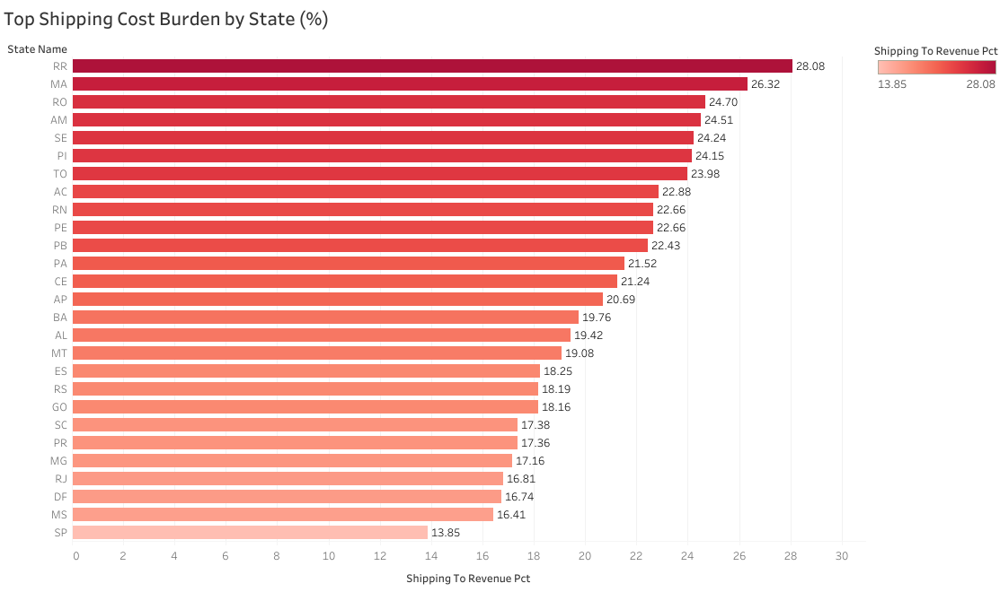
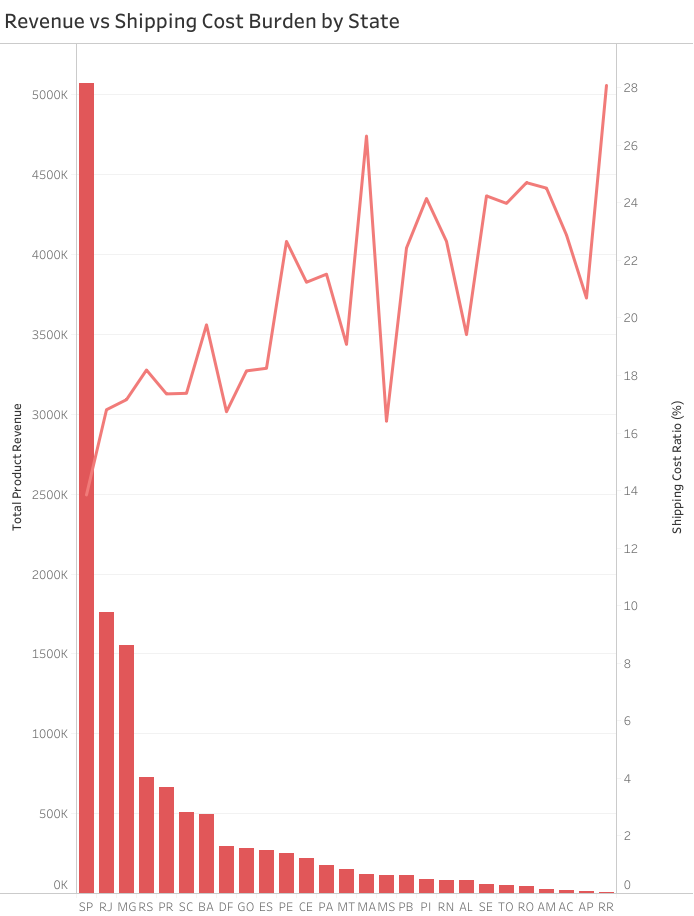

# Olist-ecommerce-insights
Analysis of Olist E-Commerce using PostgreSQL and Python to optimize marketing, payment strategy, and delivery performance

## Data Ingestion

This step moves the raw data from local CSV files into a PostgreSQL database using Python. It sets up a proper relational structure so we can run SQL queries smoothly.

The complete setup logic is handled by the Python script included in this repository.

### Key Details
* **Source to Destination:** Loads raw local CSV files directly into a local PostgreSQL database.
* **Text Fixing:** Uses `encoding='latin1'` to stop the script from crashing on Portuguese special characters.
* **Auto Dates:** Uses `parse_dates=True` so Pandas fixes all date text formats into proper timestamps automatically.
* **RAM Saving:** Pushes data in chunks of 10,000 rows to keep memory usage low and prevent system freezes.

## Q2: Target Market & Shipping Profitability (Before Buying)

**SQL:** [Q2.sql](./Q2.sql)

* **Step 2.1: Checking Raw Data** – Looked at the `customers` and `order_items` tables to see how the state locations, product prices, and shipping fees look.
* **Step 2.2: Cleaning the Tables** – Created a safe SQL View called `v_clean_orders_q2`. This removes canceled orders and fixes date formats so the calculations stay accurate.
* **Step 2.3: Final Query** – Joined the cleaned tables together. Grouped everything by state to calculate the total product sales, shipping costs, and the final `shipping_to_revenue_pct` numbers.

* **Key Insight:** Shipping cost varies a lot across Brazil. **SP (São Paulo)** has the lowest shipping burden at only **13.85%**. On the other hand, remote states like **RR** and **MA** are the most expensive, with shipping taking up over **26% to 28%** of the product price.
* **Business Action:** SP is the safest and cheapest area to run marketing ads and big discount promotions because shipping won't eat into our profits.

* **Key Insight:** The chart shows that our highest-selling states are actually the ones with the lowest shipping costs. The big revenue peak on the left belongs to SP, which combines high sales volumes with very low delivery overhead.
* **Business Action:** We shouldn't treat every high-revenue state the same way. If a state has decent sales but the shipping line sits high up, we need to bundle products together to increase the average order size and offset the delivery fee.

* **Key Insight:** There is a clear, tight link between total orders and total revenue. The dots follow a steady upward line, meaning our sales growth depends heavily on order volume rather than just a few expensive items. The darker red dots (high shipping burden) mostly sit at the lower end of the order volume.
* **Business Action:** To push the business forward, we need to focus on getting more order numbers in low-shipping regions (light-colored dots) while slowly building up warehouse hubs near the high-shipping regions to lower their costs.

