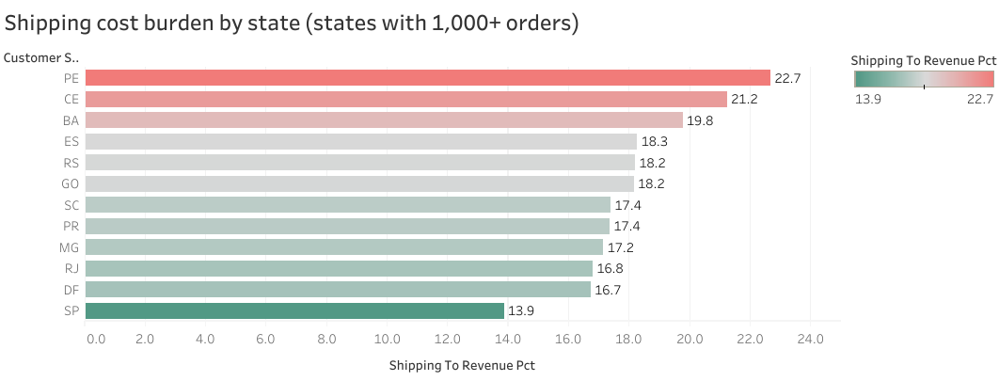
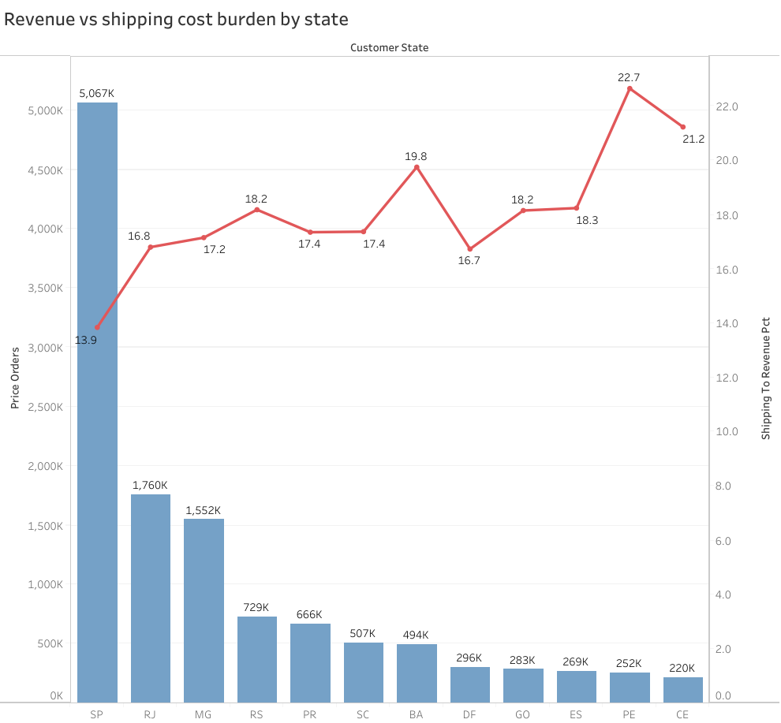
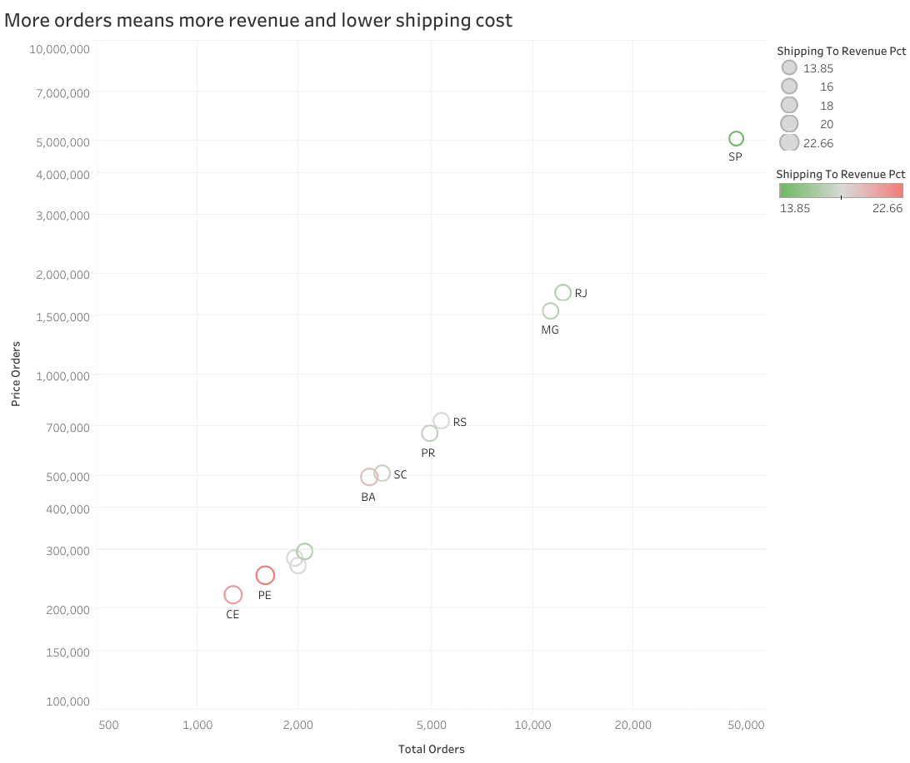
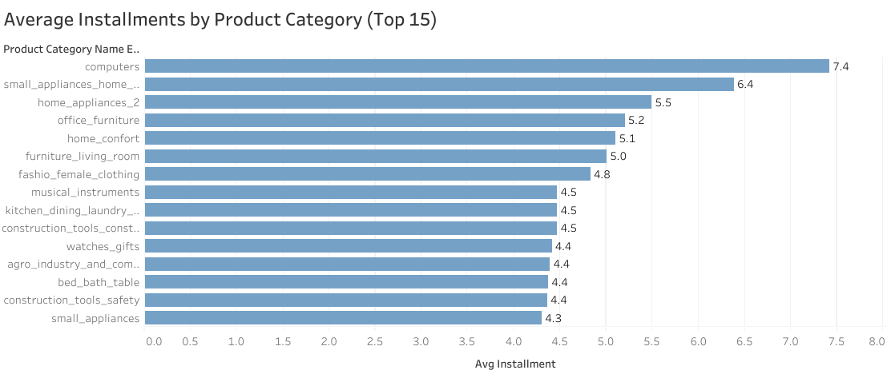
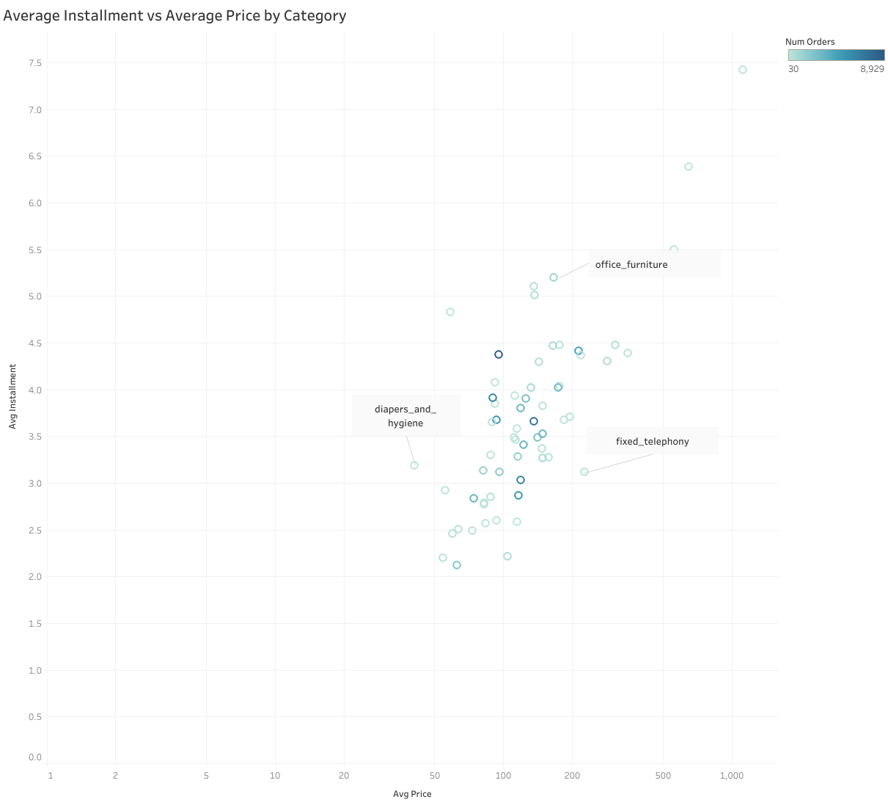
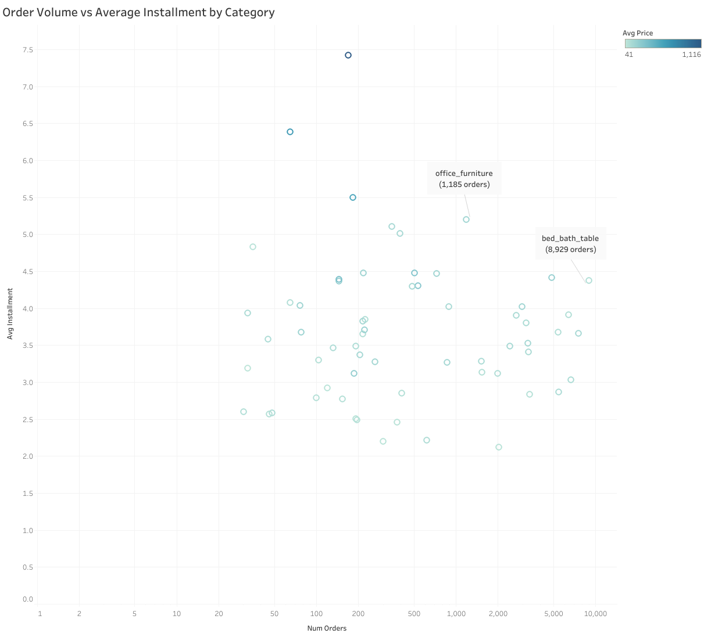
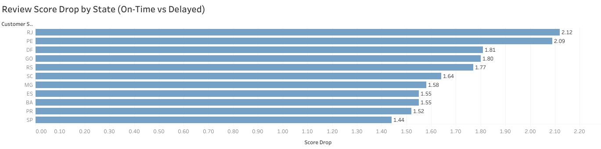
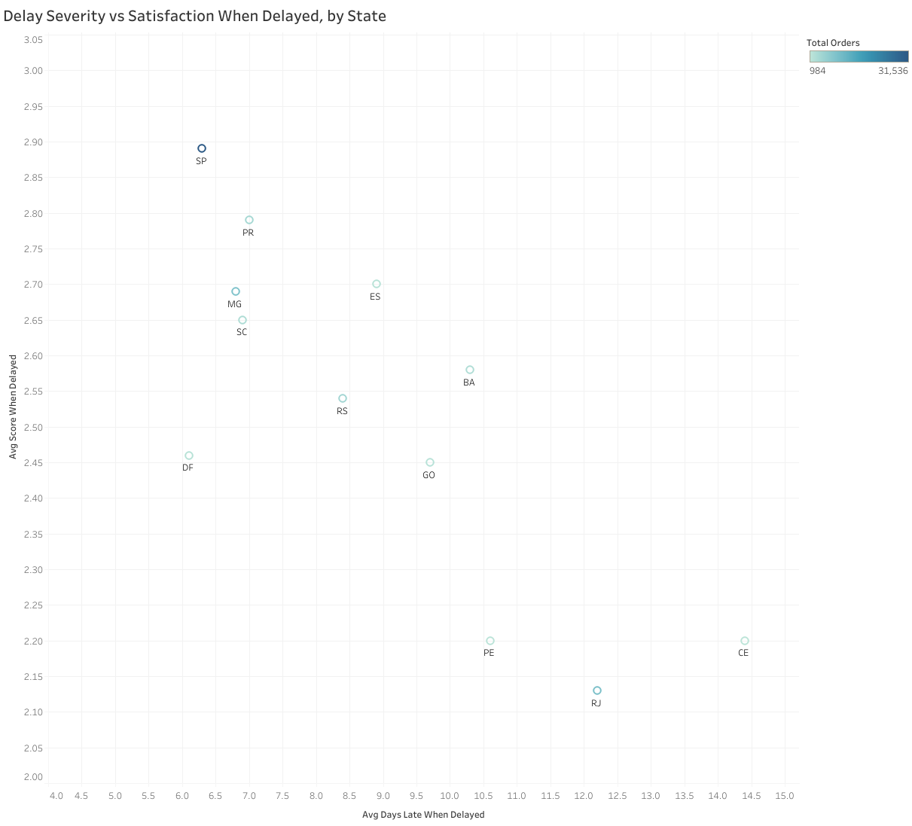
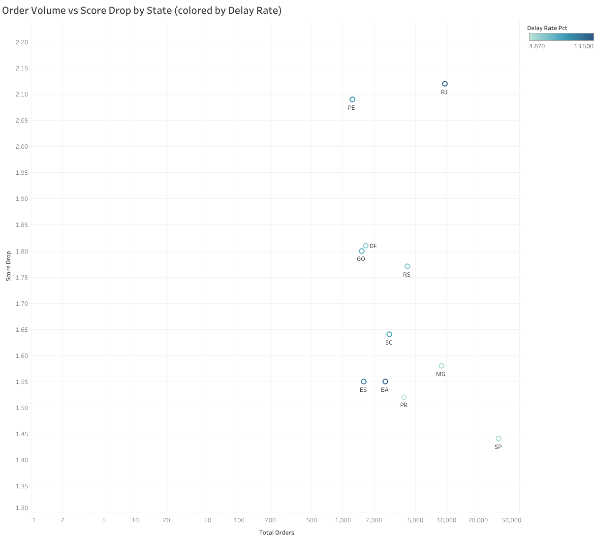

# Olist-ecommerce-insights

Analysis of Olist E-Commerce using PostgreSQL to optimize marketing, payment strategy, and delivery performance.

## Setting up the database (Step 0 in ingestion.sql)

The table schema is created with SQL alone — typing every column explicitly (text, bigint, double precision, timestamp) for all 8 raw Olist tables. Loading the actual CSV data into those tables is a manual step done through DBeaver, not part of the script.

A few things worth noting about this step:

- **Why loading is manual:** Postgres runs inside Docker in this setup, so it can only see files inside its own container — it has no access to CSVs sitting on the local Windows machine. Importing through DBeaver's **Import Data** wizard sidesteps this entirely, since DBeaver reads the file locally and streams the rows over the connection it already has open. For each of the 8 tables: right-click it in Database Navigator → Import Data → source format CSV → pick the matching file → set Encoding to `LATIN1` → Proceed.
- **Re-runnable by design:** drops `View_Q2`, `View_Q3`, and `View_Q4` before dropping the tables underneath them — Postgres otherwise blocks a table drop while a view still depends on it, so this order lets the schema be rebuilt from scratch without erroring out. 
- **Category translation table stays as-is:** `product_category_translation` is created with `product_category_name` and `product_category_name_english` as column names directly, matching what Q3.sql expects for its join onto `products` — no renaming step needed downstream.

Script: [`ingestion.sql`](./ingestion.sql)

---

## Q2: Where does shipping cost hurt margins the most?

**SQL:** [Q2.sql](./Q2.sql)

### Cleaning the data (Step 1–2 in Q2.sql)

Before writing the real query, checked how trustworthy the data actually was. Found three things worth flagging:

- **2,965 orders have no delivery date at all** — excluded from the analysis, since there's no way to know yet if they'll go through.
- **Only 96,478 of 99,441 orders are actually marked "delivered."** The rest sit in other statuses like canceled or still shipping.
- **8 orders contradict themselves** — status says delivered, but there's no delivery date attached.

Prices, shipping fees, and duplicate order IDs all came back clean, no issues there.

Based on this, the view (Step 3) filters on two conditions together: status must be `delivered`, and the delivery date can't be missing.

### Picking which states to trust (Step 4–5 in Q2.sql)

Looking at all 27 states unfiltered, a problem showed up fast: **states with very few orders had wildly swinging percentages.** RR had only 41 orders but a shipping cost of 28% of revenue, while SP had 40,494 orders and sat at a steady 13.85%.

Worked through the right cutoff in a few steps:

- Tried the common rule of n ≥ 30 first — but it didn't cut anything out. Even RR, the smallest state, had 41 orders.
- Grouped states by order count and checked how wide the percentages swung within each group. Things settle down once a state passes roughly 1,000–2,000 orders.
- Checked how much of the business gets lost at each cutoff: 1,000 orders drops 6.53% of orders and 8.52% of revenue — a reasonable trade. 2,000 orders (more statistically solid) would drop nearly 16% of revenue — too much just for cleaner numbers.

Landed on **1,000 orders** as the threshold, balancing trust in the statistics against not throwing away too much of the overall picture. The final query (Step 6) uses this cutoff and leaves 12 of the 27 states.

### Chart: Shipping cost burden by state

Among the 12 states with 1,000+ orders, shipping eats between 13.9% (SP) and 22.7% (PE) of revenue — almost a 9-point gap. PE and CE, both in Brazil's northeast, likely sit farther from the main distribution hub, which drives up their shipping costs. SP, probably home to the main warehouse, carries the lowest shipping burden of the group.

Marketing should lean into SP, DF, and RJ first, since they keep more margin per order. Operations should look at a secondary warehouse near Brazil's northeast to shorten the delivery distance to PE and CE.

**What ruled out the other explanations** (full queries in Step 7 of Q2.sql):
- Average product weight is nearly identical across PE, CE, and SP — heavier packages aren't the cause.
- Average product price in PE and CE is actually higher than SP's, not lower — cheap products aren't skewing the ratio either.
- All three states buy from SP-based sellers at a similar rate (71–78% of orders) — it's not about relying on out-of-state sellers more.
- What's left is plain distance: PE and CE sit roughly 2,000+ km from SP, where most sellers are based.

*Shows only states with 1,000+ orders. The rest were excluded — too few orders to draw a reliable pattern from.*

### Chart 2: Revenue vs shipping cost burden by state

Revenue bars drop off fast, from SP (~5M) down to CE (under 250K), while the shipping percentage line runs roughly the opposite direction, climbing from 13.85% at SP up to a peak of 22.66% at PE. Checked whether order count and revenue actually track each other — they do, ranking identically across all 12 states. The one clear break in the pattern is DF, whose shipping percentage sits lower than states with similar revenue (16.74% vs BA's 19.76%).

Likely because DF, Brazil's capital, has unusually good transport infrastructure even though it isn't an economic hub like SP. This backs up prioritizing ad spend on SP, RJ, and MG, and suggests DF's setup is worth digging into further — there may be something to apply to the mid-table states (GO, ES, BA).

**Supporting evidence** (full queries in Step 8 of Q2.sql):
- DF's average freight per item (21.07) is genuinely lower than GO (22.56), ES (22.03), and BA (26.49) — not a rounding coincidence.
- Order count and revenue rank identically across all 12 states — this chart reflects both at once, not two separate stories.
- Side note: CE's average revenue per order (~172) runs almost 40% higher than SP's (~125), despite far fewer orders — possibly because distant-state customers bundle more into each order to offset shipping cost.

### Chart 3: More orders means more revenue and lower shipping cost — the pattern holds across all 12 states

Every point lines up along a clear diagonal on the log-log scale, confirming that order count and revenue move together almost 1:1 (matches what Chart 2 showed). SP sits at the top right, the darkest green point — highest orders, highest revenue, lowest shipping cost. CE sits at the bottom left, colored red — lowest on every count.

The color gradient running from top-right to bottom-left lines up with the cause already confirmed in Step 7: distance from the distribution hub. This backs up giving SP top priority, since it wins on all three fronts at once. States like CE and BA should be operations' first focus, since they carry both a small customer base and high shipping cost at the same time.

*No outliers here, so there's nothing extra to dig into like there was for Charts 1 and 2.*

---

## Q3: Which product category relies most on installment payments?

**SQL:** [Q3.sql](./Q3.sql)

### Cleaning the data (Step 1–2 in Q3.sql)

Before writing the real query, checked how trustworthy the payment and product data actually was. Found two things worth flagging:

- **610 of 32,951 products have no category name.** These touch 1,451 orders, about 1.5% of all orders — small enough to drop. A category labeled "unknown" wouldn't help anyone deciding which banks to partner with anyway.
- **290 orders got charged on credit_card twice** — split across two cards on the same purchase, each with its own installment plan (one card at 4 months, one at 6, for example). Checked these weren't just duplicate rows first: all 290 have genuinely different installment values on each row, so they're real split payments, not an error.

Payment type nulls and duplicate order IDs elsewhere came back clean, no issues there.

Based on this, the view (Step 3) filters to `credit_card` only and collapses each order down to one row using `MAX(payment_installments)`. Two cards running side by side finish when the longer one finishes, not when you add both together — so MAX gives the real payoff length, and SUM would have overstated it.

### Picking which categories to trust (Step 4–5 in Q3.sql)

Looking at all 70 categories unfiltered, the same problem from Q2 showed up again: categories with very few orders swing wildly. `security_and_services` had exactly 1 order on record, averaging 1.0 installments — not a real pattern, just one data point standing in for a whole category.

Worked through the cutoff the same way as Q2:

- Tried the common rule of n ≥ 30 first — this time it actually held. Only 9 of 70 categories fall below that line: `la_cuisine`, `fashion_sport`, `music`, `cds_dvds_musicals`, `fashion_childrens_clothes`, `arts_and_craftmanship`, `home_comfort_2`, `flowers`, and `security_and_services`.
- Checked how much of the business gets lost at that cutoff: those 9 categories together make up only about 0.16% of the order-category rows in this analysis — nowhere near the trade-off Q2 had to make (8.52% of revenue at its 1,000-order cutoff).

Landed on **n ≥ 30** as the threshold. The final query (Step 6) uses this cutoff and keeps 61 of the 70 categories.

### Chart 1: Average installments by category

Ranked the 61 categories with 30+ orders by average installments, then narrowed the chart to the top 15 so the labels stay readable and the focus stays on what matters for a financing decision. `computers` leads at **7.4 installments**, followed by `small_appliances_home_oven_and_coffee` (6.4) and `home_appliances_2` (5.5) — all big-ticket electronics. Just behind them, `office_furniture` (5.2), `home_confort` (5.1), and `furniture_living_room` (5.0) form a second cluster of long-lasting furniture. From there down to `small_appliances` (4.3), the rest of the top 15 sit close together, all still well above the 3-month mark.

`office_furniture` stands out here — it's the only category in the top 4 backed by real volume (1,185 orders), versus 65–345 orders for the others around it. That makes it the strongest candidate for a bank installment deal: a long financing window *and* enough orders that the deal actually moves revenue, rather than a category propped up by a handful of purchases.

*Shows the top 15 of 61 categories with 30+ orders. The other 46 were left out to keep the chart readable, and a separate 9 categories were dropped earlier for having fewer than 30 orders to trust.*

### Chart 2: Average installments vs average price by category

Each point is one category, plotted by average price against average installments, colored by order count (darker = more orders behind the number). Price and installments mostly move together — the darkest, highest-volume points (`bed_bath_table`, `computers_accessories`, `health_beauty`) sit in a fairly tight band, and `computers` itself, off in the top right, has both the highest price ($1,115.67) and the highest installments (7.42) of any category. So a chunk of this pattern really is just "expensive stuff gets financed longer."

But three labeled points sit off that trend enough to matter:

- `office_furniture` reaches 5.2 installments at a price ($166.22) roughly a third of what similarly-financed categories cost — and it's one of the darker points on the chart, so this isn't a small sample throwing off the average.
- `diapers_and_hygiene` sits higher than its $40.67 price would suggest, out-financing categories that cost nearly double.
- `fixed_telephony` breaks the pattern the other way — a comparatively high price ($225.84) paired with noticeably fewer installments (3.12) than other categories at that price level.

Full check queries are in Step 7 of Q3.sql. Price explains part of the story, but categories like `office_furniture` and `diapers_and_hygiene` clearly get financed longer than their price alone would predict — category carries real signal on its own, not just a stand-in for price.

### Chart 3: Order volume vs average installments by category

Each point is one category, plotted by order count (log scale) against average installments, colored by average price. Plotting order count this way checks that the ranking in Chart 1 isn't being driven by categories that barely scraped past the n ≥ 30 cutoff. It isn't — `bed_bath_table` (8,929 orders) sits far right with a solid 4.4 installments, and `office_furniture` (1,185 orders) holds its position near the top of the chart at 5.2, both backed by real volume rather than a handful of lucky small samples. The categories with the shortest installment averages near the bottom are also backed by decent order counts, so the low end of the ranking is just as trustworthy as the high end.

The color adds one more check on top of that: points near the top of the chart (highest installments) tend to run darker (higher average price), matching what Chart 2 already showed — but a few lighter-colored points still reach the upper-middle of the chart, categories getting financed longer than their price alone would suggest, the same exceptions flagged in Chart 2.

*No further outliers to dig into here — order volume backs up what Chart 1 and Chart 2 already showed.*

---

## Q4: Does delivery delay hurt review scores, and does it hit some states harder than others?

**SQL:** [Q4.sql](./Q4.sql)

### Cleaning the data (Step 1–2 in Q4.sql)

Before writing the real query, checked how trustworthy the orders and reviews data actually was. Found two things worth flagging:

- **2,971 of 99,441 orders never got a real delivery outcome** — canceled or still shipping, with no delivery date to measure delay against. Excluded, same reasoning as Q2.
- **340 orders have more than one review row on the same order.** Checking how far apart those scores were: 223 (~66%) were exact duplicates (no distortion at all), 53 (~16%) differed by 1 point (still a fair average), and 64 (~19%) disagreed by 2+ points — e.g. a 1-star and a 5-star on the same order, which averages out to a "3" nobody actually gave. Those 64 were dropped entirely from the pool of orders eligible for analysis. Once combined with the delivered/date filters, this removed 57 orders from the final 75,355 → 75,298 (7 of the 64 had already been excluded by those other conditions). At 0.08% of the analysis set, the cost is negligible next to the distortion they'd otherwise cause.

Delivered orders with no review at all were also excluded (21,115 orders) — there's nothing to analyze satisfaction against without a score.

Based on this, the view collapses duplicate reviews with `AVG()` (unlike Q3's `MAX()` — installments are one commitment length, review scores are separate opinions, so averaging is the fairer summary), skipping any order where those opinions contradict each other by 2+ points. Final clean set: 75,298 orders.

### Picking which states to trust (Step 5–6 in Q4.sql)

Looking at all 27 states unfiltered, the same problem from Q2 and Q3 showed up again: small states swing wildly. Worked through the cutoff the same way:

- Tried n ≥ 30 first — didn't cut anything, same as Q2. Too loose for this dataset.
- Reused Q2's 1,000-order threshold and checked the cost: excludes 7.87% of orders, close to Q2's 8.52% — confirms 1,000 is a reasonable bar here too, not just borrowed blindly.

Landed on **1,000 orders**. The final query keeps 11 of the 27 states.

### Chart 1: Review score drop by state (on-time vs delayed)

Among the 11 states with 1,000+ orders, a late delivery costs anywhere from **1.44 stars (SP)** to **2.12 stars (RJ)** off the average review score, with `PE` close behind at 2.09. Notably, `CE` — one of Q2's two highest-shipping-cost states, alongside PE — doesn't appear here at all: it has only 984 orders in this cleaned dataset, just under the 1,000-order bar (checked directly).

Every state loses at least 1.4 stars when an order runs late — delay clearly damages satisfaction everywhere, not just in a handful of places. But the *ranking* here doesn't cleanly match Q2's shipping-cost ranking: RJ, not flagged as high-shipping-cost in Q2, tops this list, while PE (which was flagged) sits just behind it.

### Why doesn't the ranking match Q2 — and does distance still matter?

Digging into `PE`, `CE`, and `SP` directly (full query in Step 8 of Q4.sql) shows the connection to Q2 is still there, just one layer deeper than `score_drop` shows:

- When a delay happens, `CE` orders run **14.4 days late** on average and `PE` orders run **10.6 days late** — more than double `SP`'s **6.3 days**.
- Longer delays hit harder: `CE` and `PE`'s average score *when delayed* is **2.20**, noticeably below `SP`'s **2.89**.

`score_drop` nets out each state's own on-time baseline, which varies for reasons beyond delay alone — that's why it doesn't rank PE/CE at the top the way Q2's shipping-cost figures might predict. But looking at delayed orders on their own, the pattern from Q2 holds: **states farther from the distribution hub don't just pay more to ship — when something goes wrong, it takes longer to fix, and customers punish that longer wait with a lower score.**

*Shows only states with 1,000+ orders (CE included separately above despite falling just under the cutoff, since it's directly relevant to the Q2 comparison).*

### Chart 2: Delay severity vs satisfaction when delayed, by state

Each point is one state, plotted by how many days late an order runs (when it does run late) against the average review score on those delayed orders, colored by order volume. The broad pattern holds: the three longest-delay states — `CE` (14.4 days), `RJ` (12.2 days), and `PE` (10.6 days) — sit at the bottom on score (2.20, 2.13, 2.20), while `SP`, among the shortest delays (6.3 days), sits at the top (2.89).

It's not a clean straight line, though, and two states are worth calling out: `DF` has the shortest average delay of the whole group (6.1 days, even shorter than SP's) but a middling score (2.46) — well below what that short delay would predict. And `BA` (10.3 days) scores higher (2.58) than `GO` (9.7 days, 2.45) despite running a longer delay. So delay length is a real driver of dissatisfaction — confirming the distance → longer delay → lower score chain from Q2 — but it isn't the only one; something else pulls DF's score down and lifts BA's on top of that effect.

*Shows the 11 states from Chart 1 plus CE, included here despite its 984 orders since it's directly relevant to the Q2 distance comparison.*

### Chart 3: Order volume vs score drop by state

Each point is one state, plotted by total order volume (log scale) against score_drop, colored by what share of orders in that state ran late. This checks that Chart 1's ranking isn't being driven by states with too little data to trust — it isn't. `RJ` (score_drop 2.12) sits near the top of both the volume axis (9,576 orders) and the color scale (13.4% of orders delayed), and `PE` (2.09) shows a similarly high delay rate (10.4%) despite a smaller order base (1,229) — both have real weight behind their numbers, not a handful of lucky small samples. `SP`, at the opposite end, combines the highest volume (31,536 orders) with one of the lowest delay rates (5.8%) and the lowest score_drop (1.44), consistent with everything Q2 and Chart 1 already showed about it.

One nuance worth flagging: `BA` has the single highest delay rate of all 11 states (13.5%, edging out RJ) but a middling score_drop (1.55) — nowhere near the top. A high delay *rate* doesn't automatically translate to a high score *drop*; Chart 2 already showed that how long a delay runs matters as much as how often one happens, and BA's case reinforces that a high frequency of delays alone doesn't guarantee severe damage to the score.

*Shows the 11 states from Chart 1. CE, present in Chart 2 for its relevance to the Q2 comparison, is excluded here since this chart is specifically validating Chart 1's ranking, which CE was never part of.*

---

### Summary

Delivery delay clearly hurts satisfaction — every state loses at least 1.4 stars on delayed orders (Chart 1) — and Q2's distance-from-hub finding still shows up here, just one layer removed from the raw shipping-cost numbers. States farther from SP's distribution hub tend to run longer delays when something does go wrong, and that longer wait is what drives the score down further (Chart 2), not distance or shipping cost directly. Order volume backs this up rather than explaining it away: the states hit hardest (RJ, PE) have enough orders behind them to trust the numbers, and a high rate of delays alone (BA) doesn't guarantee a high score drop the way delay *length* does (Chart 3).

For the business: closing the review-score gap isn't primarily a shipping-cost problem — it's a delivery-time-recovery problem. The fix that would move the needle most isn't necessarily cheaper shipping to CE, PE, and RJ, but faster resolution once an order is already running late in those states, since it's the length of the delay, not just the fact of one, that customers punish hardest.
